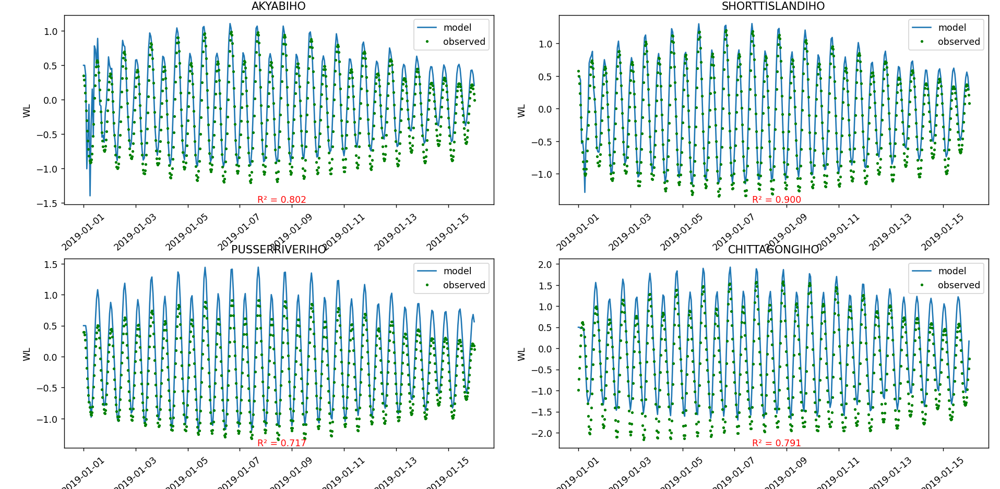

# Plotting of delft3d-flow output file

## Steps of setup:
1. Add `FlNcdf = #hismap#` this line at the end of your `*.mdf` file
2. set the monitoring/observation point name to `*.tek` file name. (e.g. AKYABIHO)
3. install python
4. open this folder in a terminal, run `pip install -r requirements.txt`
5. add the `plot.py` inside you model folder
6. start the run of your model and after the model keeps running, run `plot.py`. You will see the changing plot.

## Assumptions:
1. there is only one `trih-*.nc` file and one `*.obs` file in the model folder

## TODO
- [ ] support of csv as obserbation file 
- [x] changing of number of plot according to monitoring point

(note: `*` means anything)
