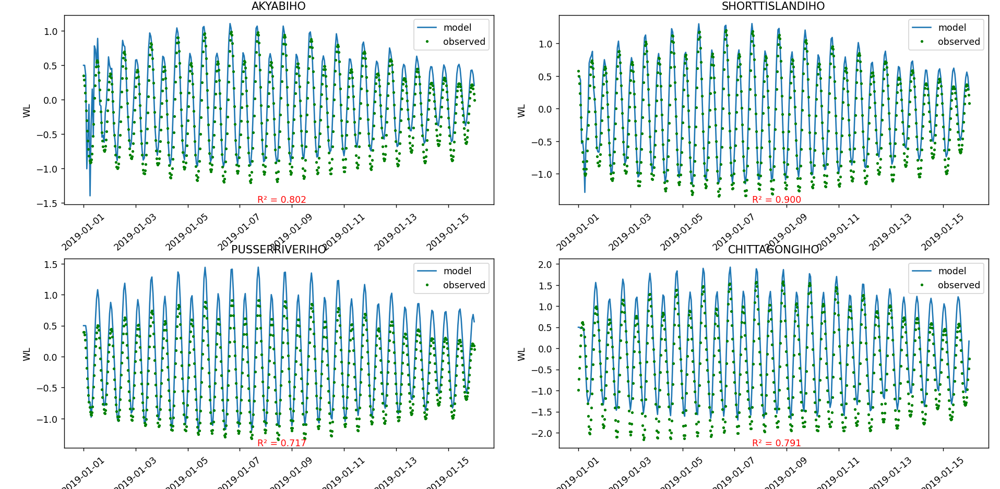

# Plotting of delft3d-flow output file

1. Add `FlNcdf = #hismap#` this line at the end of your `*.mdf` file
2. set the monitoring/observation point name to `*.tek` file name. (e.g. AKYABIHO)
3. install python
4. open this folder in a terminal, run `pip install -r requirements.txt`
5. add the `plot.py` inside you model folder
5. in the `plot.py`, change the observation and histrory file name according to your need. (e.g. `*.obs`  and `trih-*.nc`)
6. start the run of your model and after the model keeps running, run `python plot.py` in your terminal. You will see the changing plot.

(note: `*` means anything)

TODO
- [ ] support of csv as obserbation file 
- [ ] changing of number of plot according to monitoring point

